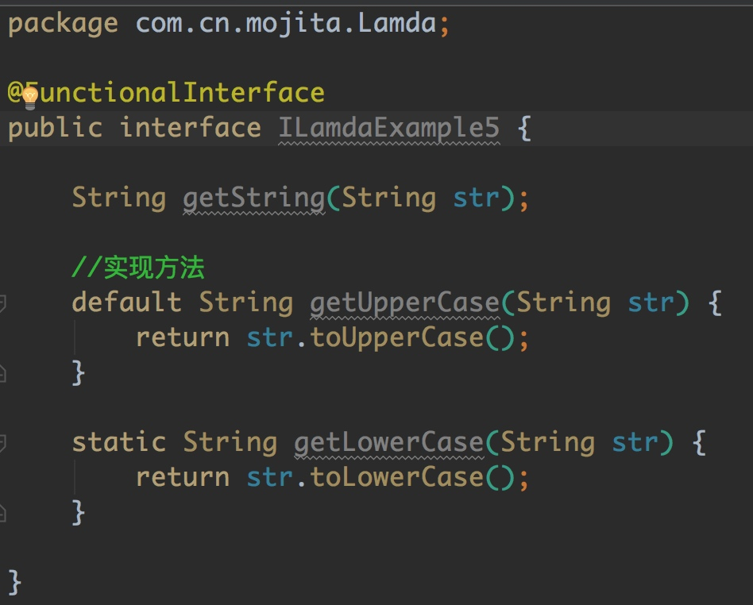

# java1.8 Lamda表达式从入门到放弃

#####　　天苍苍地茫茫，苍茫的天涯是我滴爱！卡，导演我躺哪？

####Lamda表达式？怕是要疯掉，这是啥玩意？能吃哇？能干啥？为啥要有？

>没错，Lamda表达式，疯掉？不存在的！（很多年前）
>js：java,你能方法当参数传递？
>java：emmmm
>c#：java,你有Lamda？你能支持集合并行处理？
>java：emmmmm
>python/ruby.....：java,你能支持函数式编程？
>java：emmmm
>java：老子有匿名内部类。
>c#：我写一行你写十行？
>java：emmmmmm
>（多年后的现在）
>我：java,你为啥那么杂？你为啥都要有？你轮子为啥那么多？你要上天哇？
>java：emmmmm，上面的你们一起上！现在我也有Lamda，我的Stream也能支持集合并行处理，尴尬

尘封的故事终将成为历史，崭新的生命又将踏上新的征程！苦逼的道友又要上路啦.....

#####故事刚开始，Lamda表达式到底是啥玩意？
>Lamda表达式,学习了各函数式编程语言所得的一点灵感而创造的产物，面向对象也想拥有函数式编程的简洁、灵活、优雅，c#中很早就有，java在多年以后也已“沉沦”，语法糖是甜的！突然想起，农夫山泉，喝着有点甜！


#####说了这么多，java中Lamda的表现形式是怎么样的？

```
	system.out::print
    (x1,x2)->x1+x2
    ()->{}
    (y) -> System.out.println(y);
    Comparator<Integer> comparator1 = Integer::compare;
```
很多年前，你创建对象是这样的：`Student student = new Student();`
现在可以这样写：`Supplier<Student> student = Student::new;`

上面这些都只是来`混个眼熟`，让你一眼就能看出什么是Lamda表达式，总结就是，只要出现`->`、`::`这两个新的语法的时候就是咯！这里不用关上面这些伪代码都是干啥用的！

######注意：上面这些都是前情提要！！我先画个分割线（0^ ^ 0）

---

####Lamda表达式知识点：
>Lamda基础语法
>功能性接口
>方法引用
>构造函数引用

是不是很easy，好啦，全剧终！！！！！！


####功能性接口初级篇：
　　`1.8`都已经出新的语法啦，所谓`Lamda表达式`，所以呢也就需要一些新的支持，没错，所谓的`功能性接口`就是为了支持`Lamda表达式`而缔造的产物。接下来就来了解下什么是功能性接口吧？

先来说下概念吧：
>什么是功能性接口？
>　　接口中只有一个抽象方法的接口叫做功能性接口（这句话适用99.999%`敲黑板`重点,例外情况下面会讲）
>用什么来表示功能性接口？
>　　用注解`@FunctionalInterface`来进行标示，当然没有这个标示只要满足上面一条的也能叫功能性接口哦
>那为啥还要有该注解？
>　　添加了该注解能够让其他程序员一眼看出是否为`功能性接口`，同时在编写接口的时候他能进行编译检查，看你写的接口是否满足要求

既然知道了上面这些游戏规则，那就动手来干吧，先眼熟一下什么是工功能性接口：

```
package com.cn.mojita.functional;

//抽象接口眼熟
public interface FunctionInterfaceOne<T> {

    boolean isExist(T t);

}
```
`上面的是一个功能性接口，满足要求，虽然没有用@FunctionalInterface注解修饰`

```
package com.cn.mojita.functional;


@FunctionalInterface
public interface FunctionInterfaceTwo {
    
    String getUpperCase(String str);
}
```
`上面的这个是使用@FunctionalInterface注解修饰的功能性接口`

上面本萌说过，该注解是可以有语法检查的，无图无真相，上图：

`当使用了注解@FunctionalInterface的时候，但是没有抽象方法的时候：`


######不符合上面规则所说的，所以报错咯

`当使用了注解@FunctionalInterface的时候，有多个抽象方法的时候：`

######同样是不符合上面规则所说的，报错

`正确的姿势是下面这样的：`


这里不难吧，很好理解对不对，下面再给一个泛型和功能接口对应的小栗子看看：
>要求：要求写一个功能接口，接口中的抽象方法为接收两个参数，两个参数类型为泛型分别为T、S，并且返回一个泛型的值R，方法名就定为`function`?


好了，上面这个例子也写完了，只要这个例子完了并且知道啥意思，那以后你遇到的泛型接口就轻松一些啦，高级的功能性接口还有，但是那些都是在那0.001%的范畴里面了

下面还是给几个例子练手吧：
>1、请写出一个功能性接口，方法自定义，接收一个参数T，返回一个Boolean
>2、请写出一个功能性接口，方法自定义，接收一个参数Boolean，返回一个Boolean(这里是jdk中的Boolean)
>3、请写出一个功能性接口，方法自定义，接收一个参数T，返回一个R

######写之前请注意不要乱用泛型，基本类型你懂该怎么处理的，写出下面这种本萌会嘴角上扬，秒变神兽的哦


---

#####Lamda表达式语法：

上面的内容都看懂了之后，开始学习Lamda表达式的语法吧，语法学完了就可以上练兵场啦，所以语法也是很重要的，但是上面的内容还没有完，下面会继续，按照我思路跟着节奏来

>语法：
>Lamda语法就`()`、`->`、`{}`这么三个符号就可以概述，甚至只需要`->`这么一个操作符就能概述，比较另外两个都是已近存在的
>`->`，读作Lamda操作符，将Lamda表达式拆分成两个部分
>左边：Lamda表达式的参数
>右边：Lamda所执行的功能，也称之为Lamda体

说完了这些是不是感觉`what are you 弄啥嘞？`，那么简单？你不会在骗我？
没错，就这么点东西，好啦全剧终！！！！

略略略，接着回来，下面通过匿名内部类和Lamda表达式进行对比一下你就知道他的糖有多甜：

>要就：请写出对两个元素进行对比的例子，分别使用匿名内部类和Lamda表达式进行展现

`匿名内部类的实现：`

```
	@Test
    public void test1() {
        Comparator<Integer> comparator = new Comparator<Integer>() {
            @Override
            public int compare(Integer o1, Integer o2) {
                return o1.compareTo(o2);
            }
        };

        System.out.println(comparator.compare(1,2));
    }
```

`Lamda表达式的实现：`

```
	@Test
    public void test2() {
        Comparator<Integer> comparator = (x1,x2) -> x1.compareTo(x2);
        System.out.println(comparator.compare(1,2));
    }

```

　　上面这个例子也是很多网上博客中在流传的例子，但是却很能说明问题，看看代码的简洁，在使用匿名内部类进行实现的时候会产生很多不必要的代码，Lamda表达式枝江最重要的内容提取出来，所以代码的简洁程度明显就高一个级别咯！

　　通过上面的这个例子，暂且不需要你马上知道怎么使用Lamda表达式，只是让你知道他的一些好处，同时通过上面的例子可以看出`->`操作符左边和右边，分别就是`参数`和`Lamda体`，下面我们来看Lamda到底怎么用的！
　　
　　都说了`Lamda`的使用离不开所谓的`功能性接口`，那我们就根据上面这个例子，我们来看看，`功能性接口`到底是怎么用的？
　　
　　首先看下`Comparator`这个接口中的内容，看看他是不是功能性接口？


　　好了，我们通过源码，看到确实是这么一回事，确实是功能性接口，同时也满足我所说的那个规则
　　
　　上面验证了需要功能性接口进行支持，现在来说说，`功能性接口`到底是怎么支持的：
　　
　　`Comparator<Integer> comparator = (x1,x2) -> x1.compareTo(x2);`
　　
　　这是上面写的Lamda表达式：看`Comparator<Integer>`

　　熟悉吗，如果上面说`功能性接口`的时候，你写了例子，那么其实就很简单，这里就是泛型，看上图中的源码`Comparator<T>`和方法`int compare(T o1,T o2);`
　　
　　所以，这里就指定了类型为`Integer`类型，这里`=`左边的就研究清楚了
　　
　　`=`右边的，`(x1,x2) -> x1.compareTo(x2);`
　　
　　看到这，我想你会问，括号中的是什么？为啥他有两个参数？他是什么类型的参数？右边东西是啥？他只能写一句语句嘛？x1.compareTo(x2),可我没实现啊，怎么能调用？
　　
#####现在一个一个来解决这些问题（小重点）：
>1、括号中的`x1`、`x2`是什么？
>是参数，准确的说这就和方法后面的参数一样，他是形参，所以名字你可以随便取
>2、为啥他有两个参数？
>当我们需要使用Lamda表达式的时候，我们是需要找到`功能性接口`的，那么功能性接口中的`唯一的`那个抽象方法的参数就和这里`()`中的参数进行对应，同时`返回值`也是对应的
>3、右边的东西是啥？
>右边的叫做Lamda执行语句，也叫Lamda体，上面说过，这里再说一遍。
>4、右边的语句只能写一句嘛？
>当然不止只能写一句啦，根据你的需求你可以写很多句
>5、我自己没实现，但是为啥能用？
>这个就很基础啦，你没实现但是`Integer`实现啦，x1是`Integer`类型，所以可以用

通过上面的这些说明我想你的疑问会消解一些，但是还会有疑问，下面再写一个：

```
	@Test
    public void test3() {
        Comparator<Integer> comparator = (Integer x1,Integer x2)->{
            x1 += 2;
            x2 -= 1;
            System.out.println("Hello Lamda");
            int value = x1.compareTo(x2);
            return value;
        };
        //这里调用
        System.out.println(comparator.compare(1,2));
    }
    
```

程序运行结果：


可以看到，通过这次写的和最上面用Lamda写的，你就会发现，其实还有一些只是点：

>1、其实`()`中的形参是可以指定类型的，但是指定的类型也必须是和你所使用的`功能性接口`中唯一的抽象方法是一致的类型，但是一般在使用的时候都会省去类型

######小重点：从这点可以看出，java1.8中，在Lamda这里的形参是具备类型推断的，同时返回值也是，所以你都可以不用再去指定类型，人家工程师花费了很大力气给你弄出来自动类型推断，就别在多此一举去加类型，记住java Lamda是具有自动类型推断的。

>2`->`右边，看到了吗，如果有多条语句就可以使用`{}`，然后将你想写的代码写进去，去实现你想实现的东西，如果只有一条语句那么可以`省略{}`同时也省略了`return`，他会自动返回，但是如果有多条语句的时候就不能省略`{}`和`return`

>3、你已经写好了你的`Lamda表达式`，怎么调用，其实就是调用接口中的的那个抽象方法的实现，调用了之后，你的`Lamda体`就会被执行

>4、其实呢`()`也是可以被省略的，什么时候能够被省略，就是当只有一个参数的时候，就可以省略如`x1->{}`这样的形式，这里可以不用记，后面还会进行总结

----

好了，上面这些特性那语法那讲了一大堆，理论基础已近有啦，那我们就来写个栗子：
>要求：请用Lamda表达式的形式通过线程每隔1秒打印一个数字，数字随机？


看到要求我们需要使用到Lamda，首先去找接口，需要使用接口并且是线程，那就`Runnable`了呗，然后嘞，看看是不是功能性接口吧？


看了源代码，发现确实，还真的是功能性接口，所以咯你懂得，那就用呗，实现我们自己的`Lamda体`然后调用`run`就完了呗，是吧，然后还发现`run`抽象方法既没有参数也没有返回值，所以`()`为空，也没有`return`，那就按着要求写吧，下面就是答案咯

```
	@Test
    public void test1() {
        Runnable runnable = () -> {
            while (true) {
                try {
                    Thread.sleep(1000);
                    Random random = new Random();
                    int value = random.nextInt(100);
                    System.out.println(value);
                } catch (InterruptedException e) {
                    e.printStackTrace();
                }

            }
        };
        //运行
        runnable.run();
    }
```
#####自定义Lamda表达式

这里完成之后，你会说，这有啥卵用？难道我只能用这些jdk已经有的`功能性接口`吗？

当然不是啦，如果真是这样设计的话怎么显示出人家的牛x对不对？

完全可以自定义，现在我们就来自定义自己的`Lamda`表达式来进行一些操作

>要求：1、通过自定义的Lamda实现，传入字符转将大写转化成小写

首先我们要的是自定义，那么我们不再去找什么jdk自带的`功能性接口`，我们要自己定义咯，现在分析下，`一个参数`、`一个返回值`都是`String`类型的，干吧

定义接口

```
package com.cn.mojita.Lamda;

@FunctionalInterface
public interface ILamdaExample1 {

    String getString(String str);
}

```
实现

```
	//实现:字符串转化成小写
    @Test
    public void test1() {
        ILamdaExample1 lamda = (str) -> str.toLowerCase();
        System.out.println(lamda.getString("AfsASD"));
    }
```
程序运行结果：


那将这些字符串变成大写呢？截获这些字符串呢？去重呢？所以你都可以通过这些来进行练手啦。

>要求：2、通过Lamda表达式实现，传入两个数，进行加减乘除运算，并返回值

　　先说下为啥要举这个栗子，读书的时候，老师让写计算器，当时用到了一个设计模式，叫`策略设计模式`，那当时写的时候是定义了个抽象接口里面有一个抽象方法两个参数一个返回值，具体的加减乘除的类都会去实现这个抽象接口然后自己实现自己的`加减乘除`的方法，今天有了`Lamda表达式`还需要那么麻烦嘛?
　　
　　分析下，需要两个参数一个返回值，定义接口吧：
　　
接口

```
package com.cn.mojita.Lamda;

@FunctionalInterface
public interface ILamdaExample2 {

    double compute(double x,double y);
}
```

使用

```
//实现加减乘除
    @Test
    public void test1() {
        ILamdaExample2 lamda1 = (x,y) -> x + y;
        lamda1.compute(1,2);
        
        ILamdaExample2 lamda2 = (x,y) -> x - y;
        lamda2.compute(1,2);

        ILamdaExample2 lamda3 = (x,y) -> x * y;
        lamda3.compute(1,2);

        ILamdaExample2 lamda4 = (x,y) -> x / y;
        lamda4.compute(1,2);
        
    }
```

程序运行结果：


通过上面这个例子，看起来再想想设计模式，会不会感觉更简单，这里当然是没用设计模式啦，如果要将`加减乘除`这几个分别放发哦对应的类中，不就算是封装好了吗，只不过我懒，不想写那么多类，可以脑补一下，这个时候还需要再去实现一个接口吗？显然已经不需要了呀，并且这个代码量很少啊

>要求：3、上面都是一条语句，现在来个多条语句的吧，传入一个日期Date，判断日期是否在2008年8月8日之前，如果是返回true，不是返回false，并且需要打印之前还是之后

干吧，一个参数，一个返回值

接口

```
package com.cn.mojita.Lamda;

import java.util.Date;

@FunctionalInterface
public interface ILamdaExample3 {

    boolean dateJudge(Date date);
}
```

实现

```
   //时间判断
    @Test
    public void test() {
        ILamdaExample3 lamda = (date)->{
            String dateStr = "2008-08-08";
            try {
                SimpleDateFormat format = new SimpleDateFormat("yyyy-MM-dd");
                Long time = format.parse(dateStr).getTime();
                Long dateTime = date.getTime();
                if(dateTime > time) {
                    System.out.println("大于"+dateStr);
                    return true;
                }
                System.out.println("小于等于"+dateStr);
            } catch (ParseException e) {
                e.printStackTrace();
            }
            return false;
        };
        System.out.println(lamda.dateJudge(new Date()));
    }
```

程序运行结果：


　　看完上面的这些内容呢，自定义好像也不难对不对？那就自己意淫些例子谢谢看吧，随便写咯！

　　但是还没完，有没有发现这种如果只能`自定义`或者`jdk中找那些功能接口`的设计很low，有没有感受到？难道只有指定的类才能用，或者是只要用都要自定义？

　　当然不是，人家的工程师很高大上的好伐，人家设计的东西是具有高适用用性的好伐！那还有什么设计？下面进入功能性接口中级篇
　　
#####功能性接口中级篇

　　为什么放到这里再继续，因为遇到问题才会解决问题，没有遇到烦恼之前我们是不会去解决的，上面说了，如果已使用我们就要去定义一个接口那只会让我们接口越来越多，这样的设计显然不好，当然我们能定义出高适用的接口，既然你能想到，自然人家牛x的工程师也会考虑，所以就出现了下面jdk已经为你设计好的高适用性的`功能性接口`
　　
　　那么jdk中自带了什么`功能性接口`给我们适用呢，还有他的一些概念和说法：

>1、Consumer:消费型接口
　　　　void accept(T);
>2、Supplier:供给型接口
　　　　T get();
>3、Function:函数型接口
　　　　R apply(T);
>4、Predicate:断言型接口
　　　　boolean test(T);

上面这些呢就是他们的说法：
`消费型接口`：没有返回值，只有参数；
`供给型接口`：没有参数，有返回值；
`函数型接口`：有参数，有返回值；
`断言型接口`：有参数，返回值类型为boolean，断言判断嘛；

当然你还会说这些怎么够用，我有多个参数怎么办，并且我参数类型还不同，这怎么办，当然确实做不到面面俱到，但是任然还有很多接口能提供我们的选择，这四个接口是顶层接口，那他们下面还有很多接口下面总结一下咯：

`package java.util.function`：记住这个包，jdk中提供给你的功能型接口就在这咯


上面这些都是提供给你使用的`功能型接口`，用就是了，在你想要自己定义的时候进来看看有没有满足你要求的接口，有的话干嘛还要自己定义！

使用这些接口的步骤：
1、进来看下接口上有没有泛型，各泛型在使用的时候是方法的参数还是返回值
2、看看有几个参数，参数类型是什么，还是用了泛型的参数
3、看看有没有返回值，返回值是什么，看下方法名叫啥

　　基本上就没啥勒，所以这里说完之后随便点几个进去看看，看人家的名字，其实是有规律的，以后熟悉了以后看见接口名大概就知道这个接口有几个参数有没有返回值。比如`Big`开头的，就是有两个参数的。
　　


既然现在已经知道了这些接口，那么也就可以使用人家已经定义好的接口写自己的东西咯，如果能用这些接口把上面的那些例子写一遍那就更好了！

好勒，这些接口介绍完了就好了，可以自己动手实操咯

但是还没完，接下来就是`::`操作符的使用啦，等了很久是不是很郁闷，终于要上场了，其实也没啥

---

####方法引用和构造函数引用

#####方法引用
方法引用：在Lambda体中已近有方法实现的，我们可以使用方法引用（可以理解为方法引用是Lambda表达式的另外一种形式）
　　主要有三种方法格式：
>对象：：实例方法名
>类：：静态方法名
>类：：实例方法名


对象::实例方法名，代码实现如下：

```

//使用对象::实例方法名
    @Test
    public void test1() {
    	//没有使用方法引用
        Consumer<String> com = (x) -> System.out.println(x);
		//使用了方法引用
        Consumer<String> c = System.out::println;
   		//上面这种方法引用可能你会存疑
   		PrintStream p = System.out;
        Consumer<String> com = p::println;
        //上面的这种方法你在看就不会有疑问啦
        
    }

```

######注意：在使用这种方法引用的时候，在Lambda体中调用的方法中的参数类型必须和调用的功能型接口中的抽象方法的参数类型一致。

类::静态方法名，代码实现如下：

```

//使用类::静态方法名
    @Test
    public void test2() {
        //下面是没有采用方法引用的写法的
        Comparator<Integer> comparator = (x,y) -> Integer.compare(x,y);
        System.out.println(comparator.compare(1,2));

        //下面是采用了方法引用的写法的
        Comparator<Integer> comparator1 = Integer::compare;
        System.out.println(comparator1.compare(1,2));
    }

```

对象::实例方法名

```

//使用类::实例方法名
    @Test
    public void test3() {
        //下面是没有使用方法引用的写法的
        BiPredicate<Integer,Integer> pre1 = (x,y) -> x.equals(y);
        System.out.println(pre1.test(1,2));
        //下面是使用方法引用的写法的
        BiPredicate<Integer,Integer> pre2 = Integer::equals;
        System.out.println(pre2.test(1,2));
		//再举个栗子
        Consumer<String> str = String::toLowerCase;
        str.accept("asdfasdfasdf");
    }

```

######注意：在使用equals时，在使用这种方法引用的时候还是和上面需要注意的也是一样的，方法引用都需要注意这点，其次，使用这种方法引用还需要注意的是，在Lambda表达式中的参数，第一个参数是Lambda中方法的调用者，第二个参数是Lamdba中方法的参数，才能使用这种方式进行操作。

上面这些就是方法引用的语法和一些实例，下来的话可以通过自己的一些实例再去进行尝试，每种自己都可以针对的写几个例子看看是不是这么回事，如果实在找不到jdk中符合上面的这些规则，那可以自己进行定义一些类和方法自己进行实现

#####构造器引用

构造器引用的格式如下：
>ClassName::new

下面是采用构造器引用来创建对象，现根据无参构造器进行创建，代码实现如下：

```
package com.cn.ljh;

public class Employee {
    private String name;
    private int age;
    private double salary;

    public Employee() {

    }

    public Employee(int age) {
        this.age = age;
    }

    public Employee(String name, int age, double salary) {
        this.name = name;
        this.age = age;
        this.salary = salary;
    }

}
```
上面的实体类中省略了gtter、setter方法

```

//构造器引用
    //通过无参进行创建对象
    @Test
    public void test4() {
        //下面是使用Lambda表达式进行创建
        Supplier<Employee> sup1 = () -> new Employee();
        sup1.get();         //得到创建好的对象

        //下面是使用构造器引用的方式来进行创建对象
        Supplier<Employee> sup2 = Employee::new;
        sup2.get();         //得到创建好的对象

    }

```

下面是采用构造器创建对象，同时根据有参构造器进行创建，代码实现如下：

```

//通过有参构造器进行创建对象
    @Test
    public void test5() {
        //下面是使用Lambda表达式进行创建
        Function<Integer,Employee> fun1 = (x) -> new Employee(x);
        System.out.println(fun1.apply(12));                 //得到创建好的对象

        //下面是使用构造器引用进行创建对象的操作
        Function<Integer,Employee> fun2 = Employee::new;
        System.out.println(fun2.apply(12));
    }

```

　　上面的通过使用构造器进行创建对象的操作，创建对象的构造器的参数也要我我们使用的功能型接口中的参数一致，同时要有返回值才能进行创建。
　　
　　这里完了基本上Lamda表达式算是完啦，但是还有一些高级的值得探讨的东西还在后面，包括`功能型接口`，还有一些你曾经熟记于心的概念或者是面试题将要被颠覆。
　　
　　哎呀，先去睡个觉起来再写！累啊
　　
--

######功能型接口高级篇

　　我们知道按照上面所说的`功能性接口`的规则，在工程师设计的时候或者是开发的时候必然会对原有的jdk中的一些接口进行改动和破坏，毕竟规则就在那摆着，但是又要继续兼容曾经的内容，同时还要让一些jdk中的内容能够支持使用`Lamda表达式`所以就有了下面的下文
　　
　　先举个栗子，比如在1.8之前已经实现好的一个接口，现在1.8工程师们想把这个接口设计成为也能支持Lamda表达式，会遇到什么问题？
　　
　　上面说过要想支持Lamda表达式就必须要有功能型接口进行支持，再来想想，功能型接口中只允许出现一个抽象方法，那这个就必然会对曾经已经实现好的内容造成非常大的改动，要注意jdk接口很多，实现了接口的类更是多得数不清楚，任务是不是很艰巨，工程师们要是靠蛮力，那么将会浪费大量时间在这里，并且这个工程也是极其复杂的，要支持`Lamda`就要破坏曾经的实现，任务量巨大。
　　
　　此时，工程师想说在既能够实现支持`Lamda`又不用去大面积破坏其实现类的情况下，就诞生了`default方法`
　　
>default方法，也可以称为Defender方法，或者虚拟扩展方法（Virtual extension methods)。

下面就来举个栗子说明一下：

我们呢有一个接口和一个实现类，这里呢我们是曾经的实现1.7版本的实现

接口

```
package com.cn.mojita.Lamda;

public interface ILamdaExample4 {

    String getStringUpperCase(String str);
    
    String getStringLowerCase(String str);
    
}
```

有这么一个接口，当然抽象方法可能有很多，这里呢简单写两个模拟下，下面我们再去写实现类

实现

```
package com.cn.mojita.Lamda;

public class LamdaExampleImpl4 implements ILamdaExample4 {
    
    @Override
    public String getStringUpperCase(String str) {
        return str.toUpperCase();
    }

    @Override
    public String getStringLowerCase(String str) {
        return str.toLowerCase();
    }
}
```

此时此刻呢我们实现类写好了，现在让你把上面这个接口变成能够支持`Lamda表达式的功能型接口`，怎么办？这就是上面所说的那些工程师遇到的问题，所以他们重新提出了`default方法来解决这样的问题`

改写接口1.8后

```
package com.cn.mojita.Lamda;

@FunctionalInterface
public interface ILamdaExample4 {

    String getString(String str);
    
    default String getStringUpperCase(String str) {
    	System.out.println("接口中的实现upper");
        return str.toUpperCase();
    }

    default String getStringLowerCase(String str) {
    	System.out.println("接口中的实现lower");
        return str.toLowerCase();
    }

}
```

看到这里，你就明白了，`default方法`就是将曾经定义好的抽象方法修饰了一下并且给出了默认实现，那我们再来看看实现类有没有改变呢

实现类

```
package com.cn.mojita.Lamda;

public class LamdaExampleImpl4 implements ILamdaExample4 {
	//实现类中多实现了一个方法
    @Override
    public String getString(String str) {
        return str;
    }

    @Override
    public String getStringUpperCase(String str) {
        return str.toUpperCase();
    }

    @Override
    public String getStringLowerCase(String str) {
        return str.toLowerCase();
    }
}
```

通过还是那个面可以看出，实现类呢多实现了一个抽象方法，仅此而已，这样总比要重新设计接口再去依依修改实现类快多了吧。

>让原来的接口支持`Lamda表达式`:
>1、只需要将接口中的曾经的抽象方法通过`default`修饰，给个默认实现
>2、子类去实现那个新定义的抽象方法

就完了，下面再来看用法上面我们要怎么用

```
	@Test
    public void test1() {
        //支持Lamda表达式的
        ILamdaExample4 lamda = (str) -> str.toString();
        System.out.println(lamda.getStringLowerCase("asdfasdf"));

        //曾经没有支持Lamda表达式的
        LamdaExampleImpl4 lamdaExampleImpl4 = new LamdaExampleImpl4();
        System.out.println(lamdaExampleImpl4.getStringUpperCase("asdfsadf"));

    }
```

程序运行结果


　　在这里呢就可以看出，通过这种方式呢能最小化的减少改动并且让曾经的接口支持`Lmada`表达式，也算是向下兼容，让你无缝的使用，如果你的项目中老大说让你改写曾经的借口让其支持Lamda表达式，这些就简单了吧。
　　
　　好了，还没完，现在说下颠覆你曾经一贯的奉以为真的东西，稍稍打破你的传统观念
　　
　　


####能不能装逼就看这么一嘚瑟啦

>java也走到了第22个年头了（和本萌同一年出生），很多东西根深蒂固的呗很多人记了很多年，尤其是那些一本教案用十年的老师

#####default方法的选择性实现
　　恩，好的，到这里你认为就完了吗？还没有，算是扩展知识吧，另外再告诉你`接口中`的`default方法`实现类是可以`选择性实现`的，也就是你高兴实现谁就实现谁？听起来是不是很爽？怎么爽，我下面告诉你

　　还记得有一种设计模式叫`适配器模式`吗？解决什么问题？
　　
　　大概先讲一下，我们知道曾经接口中的抽象方法，实现类是必须实现的（当然现在也是），那么就会带来一个问题，比如一个接口中有100个抽象方法，但是实现类只想实现一个抽象方法，这个时候就很蛋疼，你必须去实现这100个抽象方法，虽然可以给空实现，但是那么多冗余的代码看着都烦，所以就诞生了`适配器设计模式`来解决这样的问题，

>怎么解决：
>1、创建一个类A，去实现这一百个抽象方法，当然给的是空实现或默认实现
>2、需要使用时，直接去继承A，然后选择性去重写要用到的方法

　　这样就解决啦代码冗余的问题，但是你不觉得这种做法真的`很鸡贼`嘛，偷梁换柱，把实现变成继承，要知道一个类只能单继承但是可以多实现的哇，能用接口干嘛要去用继承，很无奈啊，曾经只能止步于此！
　　
　　现在不用啦，你如果遇到了这样的问题，直接接口中所有方法用`default`修饰一下，给个空实现，或者给个默认实现，其他实现类想用的时候直接选择性去实现就好了，从某种意义上说已经替代了`适配器设计模式`来解决这样的问题
　　
#####夭寿啦，接口还能实现方法啦

上面呢提到了`default方法`，难道没有疑问嘛？你可能会问，`what are you 弄啥嘞？接口中还能实现方法？他可是interface诶，还要不要face啦？`

如果看到这里你能提出这样的问题说明你骨骼惊奇，必将成其大器啊

>我们一贯认为接口中是不能具有实现的，曾经多少次你在面试的时候这样回答，“接口中不能有具体实现”，就想背乘法口诀一样的熟练，现在就来更新下认知吧

在1.8中接口是可以有具体实现的，无图无真相：


看到了吧，上面的default方法是实现方法,不光如此啦，还有更刺激的，看下图，那不用`default`修饰的方法呢，还能不能拥有实现方法，答案是可以，看下图：



看到了吗接口中是可以有实现方法的，并不是说只有`功能型接口`才能有实现方法，那么实现的实现的方法有什么要求吗？

>接口中的实现方法要求：
>1、方法为`default`修饰的方法
>2、方法为静态方法

只要满足上面其中一个就能在接口中创建方法实现。

所以说，现在面试官再问你，`接口中能否有具体实现？`我相信你就可以嘚瑟啦。

你以为嘚瑟一下就完了吗？不仅限于此，跟着研究的思路，再问一个问题`这样的设计是为什么？`

　　上面也说了，java沉淀了这么多年，必然有些接口已经过时，但是他还能用只不过需要一些新的扩展，但是又不能波及太多实现，所以也就有了这样的特性，所以这种方式成为了扩展接口时的一种非常便利低成本的选择，主要也是解决这样的问题的

并且，因为这样的设计也就引发了下面的问题：

　　`工厂方法设计模式`这个大家都熟吧，这里抛出一个问题？能否用这种特性使用接口的这些特性和接口能实现静态方法的这些特性去写一个`工厂方法设计模式的`例子呢？或者是一个`静态工厂设计模式`的例子呢？可以去想想看吧

#####变相多继承
　　接着在看，既然接口中能够具有实现类，那就引出另外一个问题，`变相多继承`，有没有发现，这个特性和继承有多像，虽然java只能单继承，但是通过在接口中实现方法，接着需要用到接口中的方法的实现，不就相当于继承码？

所以说呢，你自己可以写个例子：
>要求：A接口，有三个方法，B接口有三个方法，都是实现方法，可以是静态也可以是`default`修饰的虚拟方法，C类去实现A,B接口，C类中选择实现两个方法，然后调用所有A，B中的方法，看是否能调用成功？

上面的讲完之后，当你遇到下面的情况就不觉得诡异啦：
比如：当你自己写了一个类，继承了一个类，实现了一个接口，当你调用一个方法的时候，你发现子类并没有这个方法，父类也没有这个方法，object中也没有这个方法，那这个方法在那？

很显然，这个方当然是在接口中

这个例子写完，你就更加理解我说的变相继承的意思啦，也很简单，这里就不在写了

######注意：在写的时候，A，B中都包含相同的方法的时候在C类中都已经实现了A，B接口的时候就会报错，因为编译器不能知道你到底要实现的是谁，所以自己也可以写例子测试

#####剩下的那0.001%的特殊

最开始介绍`功能性接口`的时候说过一个概念，就是`接口中只能有一个抽象方法，其他的不用管`，当时说有特殊情况，所以下面就来讲讲什么特殊情况，如下图：


看到了吧，这就是特殊情况，怎么发现的？看源码的时候发现的，很诡异是吧？没错确实很诡异，看到绿色小箭头了没，啥意思，在idea中这个表示实现上层接口的意思，`what?`其实我也很懵逼，我们来看看上层接口长啥样？


整个人崩溃中

那我们点击上面的两个箭头看看，他会跳转到哪里


他们分别跳到了这，怀疑人生中

　　当看到这里的时候，我真的开始怀疑人生啦，为什么还有这种操作，`Object`是类，超类！并且，equals不是抽象，那么接口中为什么能出现这两个方法的抽象？这里是继承？显然不是继承，那是什么？我也不清楚.........


　　我们再来看，Comparator接口中的源码，看到绿色箭头了吗，它既是上层实现下来又被下层实现。我冷静的思考，这到底是啥操作，总之看到这里我怀疑人生啦，其实我直到现在也没搞明白这是什么操作！但是这就是特殊情况！

　　通过上面这个例外，至少我能肯定的是接口和这个Object是一定有着某种至少我现在还没有看到的关系，又是幕后交易

　　你说，他们没关系，但是代码跳转能跳转过去，但是你说是继承，显然又不是，因为继承下来我们能直接调用或者你需要重写，但也都不满足，你说是实现，好像也不对，毕竟Object不是一个接口，更何况他也并没有实现，卧槽，智商受到压制

智商受到压制的感觉，抽根烟冷静下

果然，印证了那句老话，书到用时方恨少。道行不够看都看不懂


####所以现在抛出一个问题：也希望有研究的小伙伴解答，这种情况到底是什么操作？


说到这里基本上没什么了吧，也不再觉得有什么玄妙的了吧，前几天有个小伙伴公司用到了Lamda，他们老大写了一个工具类都是支持`Lamda`的，并且呢，上面也没有提到所谓的方法当参数传递，刚好在这里写个很low的小栗子简述下：

```
package com.cn.mojita.Lamda;

import java.util.function.Function;

import org.junit.Test;


public class LamdaExample6 {

    //拼接sql工具类
    public String appedSql(Student student,String sql,
                           Function<Student,String> whereSql,
                           Function<Student,String> groupBy,
                           Function<Student,String> desc) {
        StringBuffer sb = new StringBuffer();
        sb.append(sql);
        String sqlTemp = null;

        if(whereSql != null) {
            sqlTemp = whereSql.apply(student);
            if (sqlTemp != null)
                sb.append(sqlTemp);
        }

        if(groupBy != null) {
            sqlTemp = groupBy.apply(student);
            if (sqlTemp != null)
                sb.append(sqlTemp);
        }

        if(desc != null) {
            sqlTemp = desc.apply(student);
            if (sqlTemp != null)
                sb.append(sqlTemp);
        }
        return sb.toString();
    }


    //实验拼接
    @Test
    public void test() {
        Student student = new Student();
        student.setId(1);
        student.setClassNum("4班");
        student.setName("张三");
        student.setAge(19);
        //例子一:SELECT * FROM student WHERE id=1;
        String sql11 = "SELECT * FROM student";
        String sql12 = appedSql(student,sql11,
                (queryWhere)->{
                    StringBuffer sb = new StringBuffer();
                    sb.append(" Where");
                    if(queryWhere.getId() > 0)
                        sb.append(" id="+queryWhere.getId());
                    else
                        return null;
                    return sb.toString();
                },
                null,null);
        System.out.println(sql12);

        //例子二:SELECT id AS id,name AS userName Where age = 18 GROUP BY classNum;
        String sql21 = "SELECT id AS id,name AS userName";
        String sql22 = appedSql(student,sql21,
                (queryWhere)->{
                    StringBuffer sb = new StringBuffer();
                    sb.append(" WHERE");
                    if(queryWhere.getAge() > 0 && queryWhere.getAge() < 150)
                        sb.append(" age="+queryWhere.getAge());
                    else
                        return null;
                    return sb.toString();
                },
                (queryGroup)->{
                    StringBuffer sb = new StringBuffer();
                    sb.append(" Group BY");
                    if(queryGroup.getClassNum() != null)
                        sb.append(" '"+queryGroup.getClassNum()+"'");
                    else
                        return null;
                    return sb.toString();
                },null);
        System.out.println(sql22);


    }
}

```

程序运行结果：


上面这个例子的我将工具类中的方法和调用的方法都放在一个测试类中，同时呢省略了Student类，懒啊，真的是。

那天小伙伴问我他要怎么改，其实只要把上面的东西都看会了，就可以改啦！小伙伴看完之后也可以去直接看你们项目上你们老大在项目上写的代码，那样收货更多！

同时呢，这个例子也就是所谓的把方法当参数传递，其实呢，这个也不能叫方法，应该叫`Lamda体`，但是不管怎样，希望能掌握呗！！


#####最后来个总结吧
>Lamda表达式：
>1、符号`->`、`::`就这么两个
>2、`->`左边是参数，右边是`Lamda体`
>3、如果参数只有一个可以省略`()`直接写参数，`Lamda体中`只有一个语句可以省略`{}和return`
>4、参数和返回值是看抽象接口中的抽象方法，你的`()`和`return`都要和这个抽象方法类型和顺序是一致的

>功能性接口：
>1、定义，上面已经有了不在赘述；
>2、自定义，功能性接口，上面也有；
>3、jdk中为我们使用方便给我们专门提供的那些功能型接口，自己去写例子，去感受，不要一上来就自定义，先找有没有符合你需求的
>4、功能性接口最重要就是，抽象方法的参数和返回，他们的类型和个数，决定了你在使用Lamda表达式时候的参数和返回值类型

最后说一下jdk从曾经的社区驱动升级，变成现在的周期性版本升级，所以每个一些年新版本就会出现，但是目前`java1.8`的支持会比`java1.9`支持的时间久，`java1.9`官方说只是一个过度版本，所以`1.8`还是很值得学习的，毕竟真的有很多地方被优化被升级，只是这些升级和改动都无声无息的在进行

哎妈呀，终于要写完了，最后，如果对`default`还想有更加深入的研究，移步这里:<http://cr.openjdk.java.net/~briangoetz/lambda/Defender%20Methods%20v4.pdf>

萌萌哒 2017年9月17日


